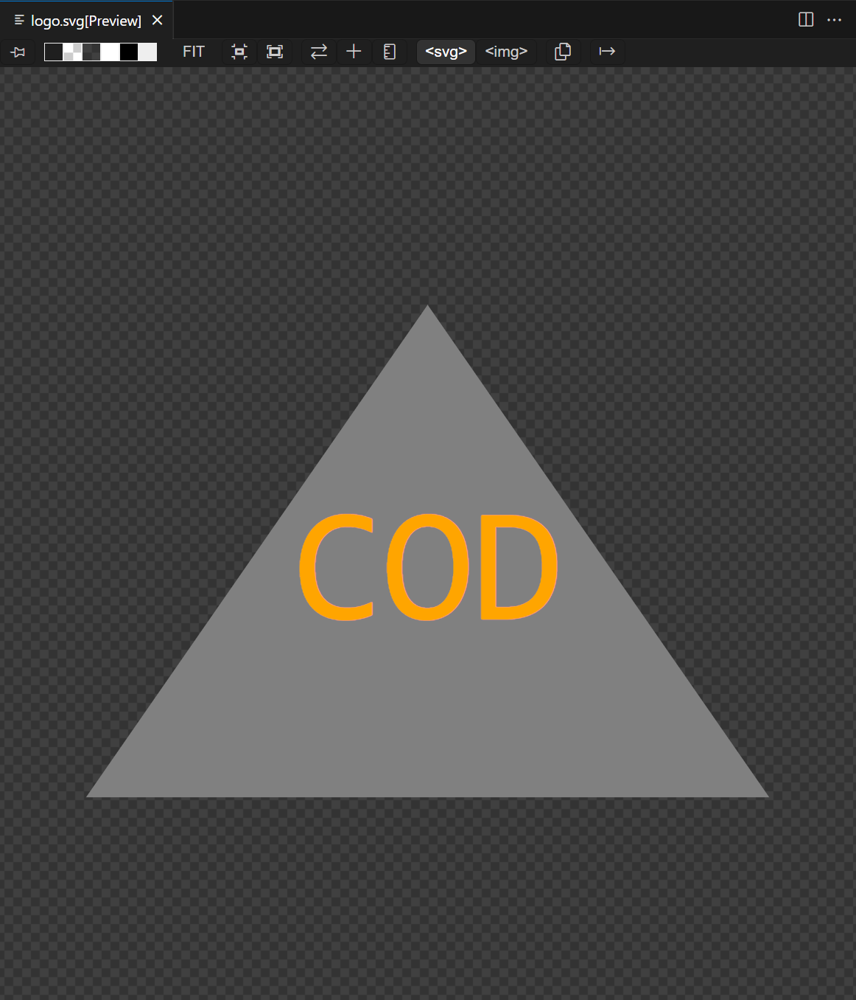

# Custom-Logo-Maker

## Badges

## Table of Contents

  - [Badges](#badges)
  - [Description](#description)
  - [Installation](#installation)
  - [Usage](#usage)
  - [Credits](#credits)
  - [License](#license)

## Description

This web application is a Custom Logo Maker. This program takes user input through an inquirer, and then generates a custom svg logo in a logo.svg file.

Here is an image of what a sample logo looks like: 

</img>

## Installation

In order to install the propper programs necessary for this application, run npm i to install the necessary programs. Once you make sure you have the propper versions of jest and inquirer installed, you should be ready to use the program!

## Usage

In order to use this program, run node index within the integrated terminal for the index.js file. Go through the user input to fill out a desirable logo.svg.

Here is a link to a video of me using this program: 

## How to Contribute

If you created an application or package and would like other developers to contribute it, you can create a fork the corresponding GitHub Repo at https://github.com/CJFeagin33/. The repo name should be the same as the project title. For any other questions, feel free to reach out to me at cjfeagin33@gmail.com

## Tests

In order to test this program, I created a shapes.test.js file under the lib directory. This runs through each possible shape to achieve a desired outcome. In order to run the test, simply type npm test into the integrated terminal.

## Credits

The UCSD Fullstacks Web Developement Program provided instructional material for this project. I was also assisted by fellow studen Phillip Ngyuen in the making of my test. 

## License

None is this project's license. For more information about licenses, please visit https://docs.github.com/en/repositories/managing-your-repositorys-settings-and-features/customizing-your-repository/licensing-a-repository